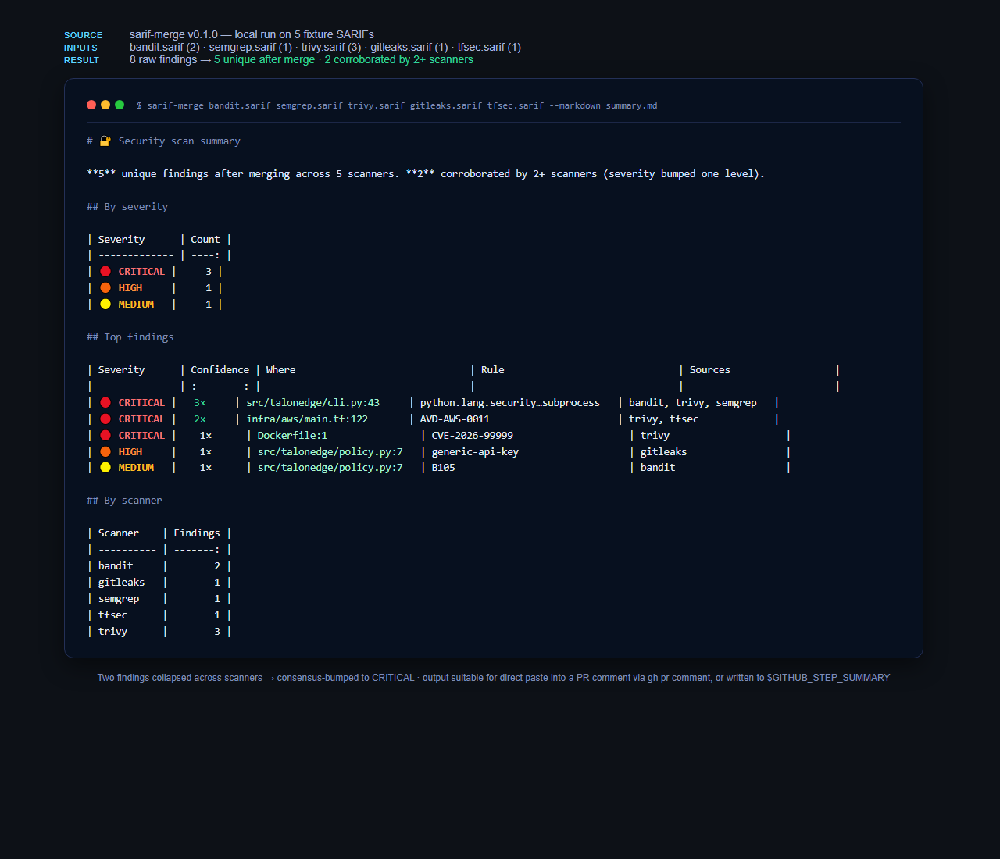
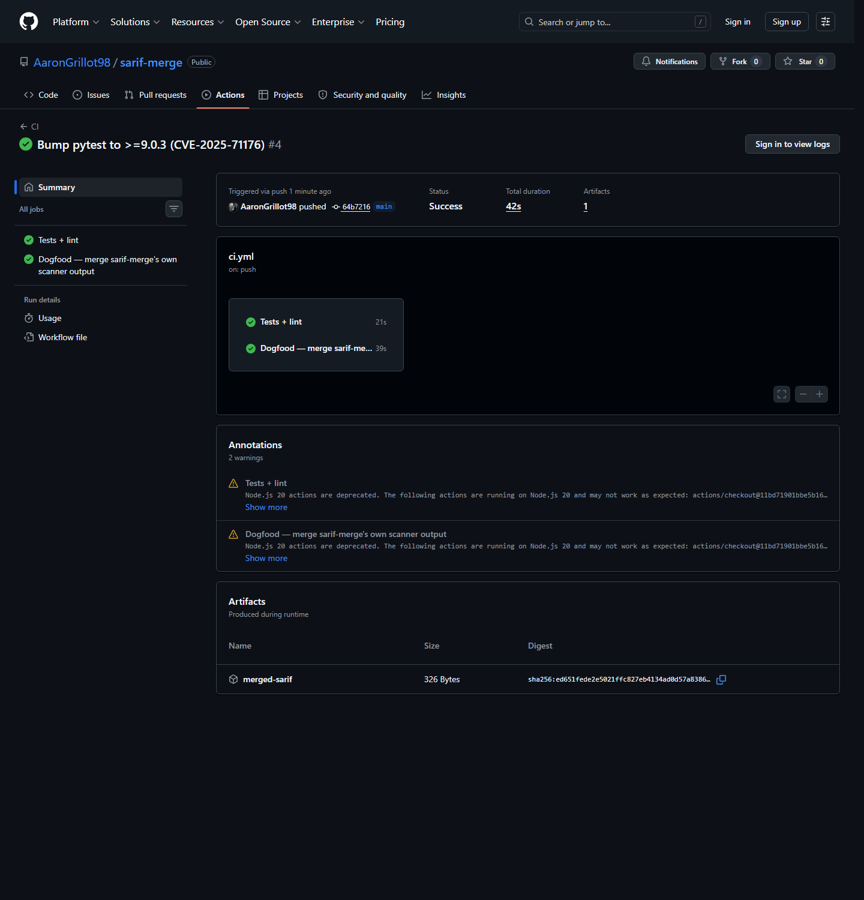
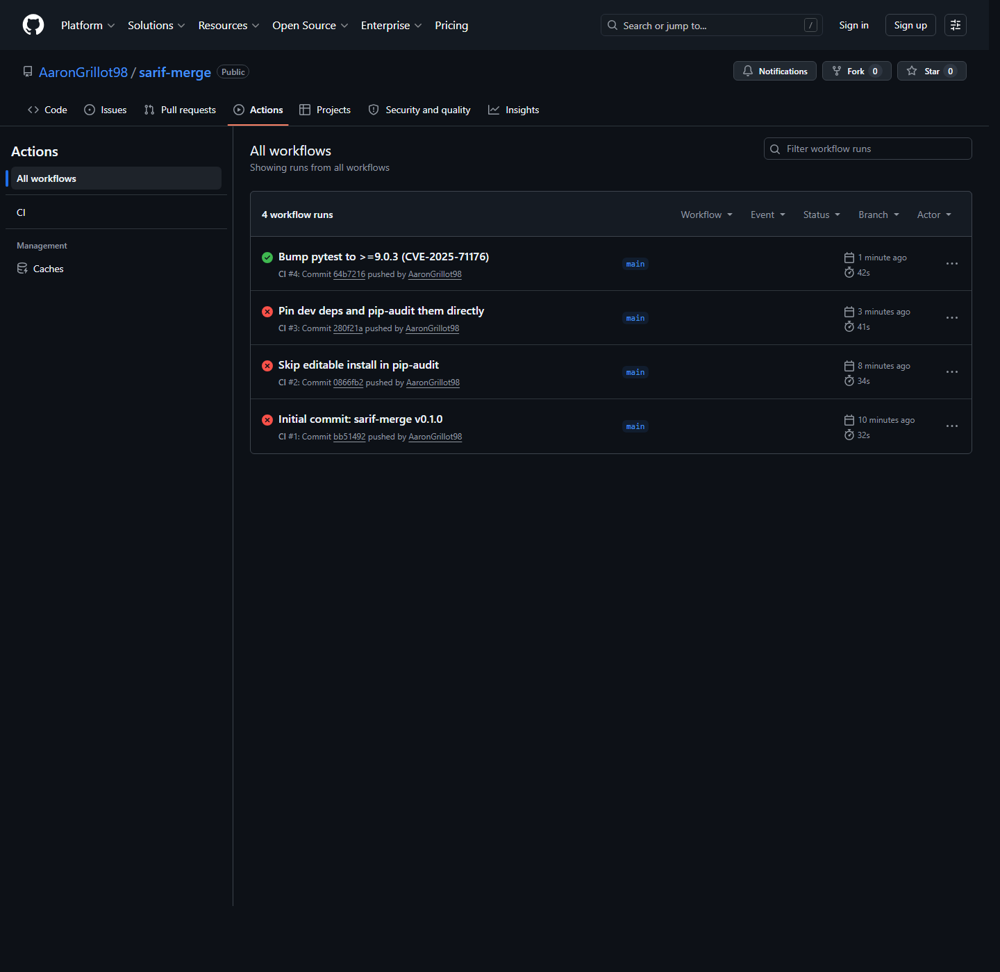
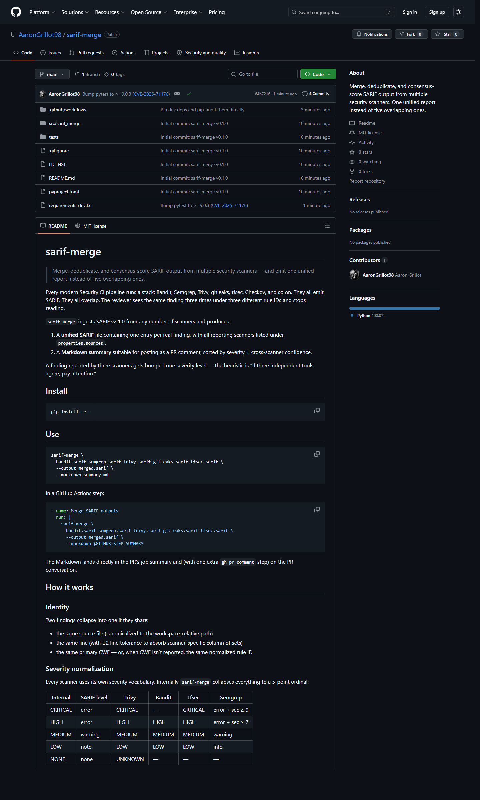

# sarif-merge

[](https://github.com/AaronGrillot98/sarif-merge/actions/workflows/ci.yml)
[](pyproject.toml)
[](LICENSE)
[](https://docs.oasis-open.org/sarif/sarif/v2.1.0/sarif-v2.1.0.html)

> **Merge, deduplicate, and consensus-score SARIF output from multiple security scanners.** One unified report instead of five overlapping ones.

Every modern Security CI pipeline runs the same stack: Bandit, Semgrep, Trivy, gitleaks, tfsec, Checkov. They all emit SARIF. They all overlap. The reviewer sees the same finding three times under three different rule IDs and stops reading.

`sarif-merge` ingests SARIF v2.1.0 from any number of scanners and produces:

- A **unified SARIF** file with one entry per real finding, listing every reporting scanner under `properties.sources`.
- A **Markdown summary** suitable for posting as a PR comment, sorted by severity × cross-scanner confidence.

A finding reported by three scanners gets bumped one severity level — the heuristic is simple: *if three independent tools agree, pay attention*.

---

## What it looks like

The Markdown output suitable for direct paste into a PR comment or `$GITHUB_STEP_SUMMARY`. **Two findings** in the example collapsed across scanners and got consensus-bumped to **CRITICAL**:

[](docs/screenshots/05-cli-output-render.png)

The unified output feeds into either GitHub's job-summary panel or `gh pr comment` for review-time visibility — without forcing reviewers to flip between five scanner tabs.

---

## Install

```bash
pip install -e .
# or directly from GitHub for use in CI:
pip install git+https://github.com/AaronGrillot98/sarif-merge
```

## Use

```bash
sarif-merge \
  bandit.sarif semgrep.sarif trivy.sarif gitleaks.sarif tfsec.sarif \
  --output merged.sarif \
  --markdown summary.md
```

In a GitHub Actions step:

```yaml
- name: Merge SARIF outputs
  run: |
    sarif-merge \
      bandit.sarif semgrep.sarif trivy.sarif gitleaks.sarif tfsec.sarif \
      --output merged.sarif \
      --markdown $GITHUB_STEP_SUMMARY
```

The Markdown lands directly in the PR's job summary and (with one extra `gh pr comment` step) on the PR conversation.

### CLI options

| Flag | Default | Purpose |
|---|---|---|
| `--output / -o` | stdout | Where to write the unified SARIF |
| `--markdown / -m` | (none) | Where to write the Markdown summary — point at `$GITHUB_STEP_SUMMARY` to surface in the run page |
| `--line-tolerance` | `2` | How many lines apart two findings can sit and still be treated as the same |
| `--bump-threshold` | `2` | Min unique scanners required before bumping severity one level |
| `--fail-on` | `none` | Exit non-zero if any merged finding meets or exceeds `low/medium/high/critical` |
| `--top` | `10` | How many findings to list in the Markdown "Top findings" table |

---

## How it works

### Identity

Two findings collapse into one if they share:

- The same source file (canonicalized to the workspace-relative path)
- The same line (with ±2 line tolerance to absorb scanner-specific column offsets)
- The same primary CWE — or, when CWE isn't reported, the same normalized rule ID

### Severity normalization

Every scanner uses its own severity vocabulary. Internally `sarif-merge` collapses everything to a 5-point ordinal:

| Internal | SARIF level | Trivy | Bandit | tfsec | Semgrep |
|---|---|---|---|---|---|
| CRITICAL | error | CRITICAL | — | CRITICAL | error + sec ≥ 9 |
| HIGH | error | HIGH | HIGH | HIGH | error + sec ≥ 7 |
| MEDIUM | warning | MEDIUM | MEDIUM | MEDIUM | warning |
| LOW | note | LOW | LOW | LOW | info |
| NONE | none | UNKNOWN | — | — | — |

### Consensus scoring

Each merged finding gets a `confidence` count = number of unique scanners that flagged it.

When confidence ≥ 2, severity is bumped one level (capped at CRITICAL). The intuition: agreement from independent tools is a stronger signal than any single tool's heuristic.

---

## CI / quality

Tests run on every push and PR. The CI workflow itself runs three checks:

- **pytest** — 48 tests, including negative paths for malformed SARIF, every scanner-vocabulary edge case, and CLI failure modes
- **bandit** — SAST on `src/`, fail-closed on medium+
- **pip-audit** — pinned dev deps audited; the build will fail-closed on any known CVE
- **dogfood** — runs `sarif-merge` against the project's own `bandit` + `semgrep` SARIF and uploads the result as an artifact

[](docs/screenshots/02-ci-green.png)

The CI history records the debugging arc honestly — including a failed build that pip-audit caught (CVE-2025-71176 in a transitive dev dep) and the commit that fixed it. Fail-closed Security CI doing exactly its job:

[](docs/screenshots/04-ci-history.png)

---

## Repo

[](docs/screenshots/01-repo-home.png)

---

## Output

### Markdown summary (PR comment)

Header with totals, by-severity table, top-N findings table, by-scanner breakdown.

### Unified SARIF

Compliant with [SARIF v2.1.0](https://docs.oasis-open.org/sarif/sarif/v2.1.0/sarif-v2.1.0.html). Each merged finding's `properties.sources` lists every scanner that reported it; the `level` reflects the consensus-bumped severity, and `properties.consensus_severity` plus `properties.base_severity` preserve both values for downstream consumers.

```jsonc
{
  "ruleId": "...",
  "level": "error",
  "message": { "text": "..." },
  "locations": [...],
  "properties": {
    "sources": ["bandit", "trivy", "semgrep"],
    "confidence": 3,
    "consensus_severity": "CRITICAL",
    "base_severity": "HIGH",
    "cwe": ["78"],
    "original": { /* per-scanner properties preserved */ }
  }
}
```

---

## Pairs with

This tool is the natural follow-on to a fail-closed Security CI like the one in [TalonEdge-Secure-Deploy](https://github.com/AaronGrillot98/TalonEdge-Secure-Deploy), which runs Bandit + pip-audit + gitleaks + tfsec + Trivy independently. Drop `sarif-merge` after those scanners and the noise compresses to a single PR comment.

## License

MIT — see [LICENSE](LICENSE).
